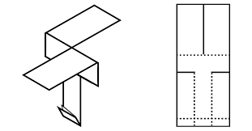
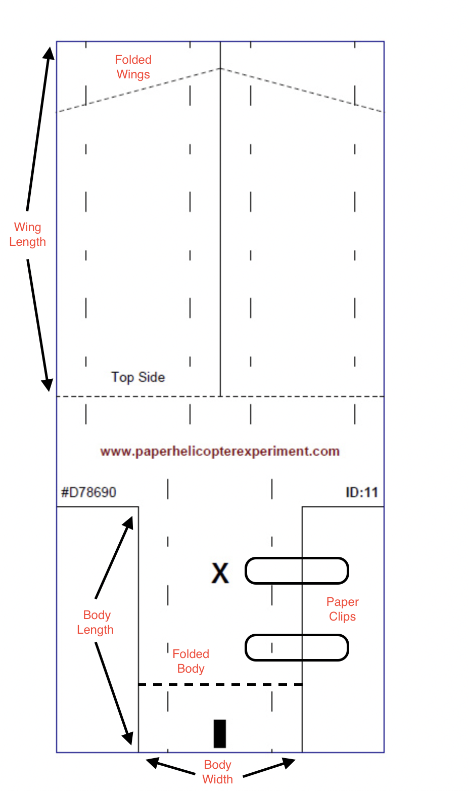

```{r Front Matter, include=FALSE}
# clean up & set default chunk options
rm(list = ls())
knitr::opts_chunk$set(echo = FALSE)
# packages
library(tidyverse) 
library(mosaic)  
library(FrF2) # tools for design and analysis of fractional factorials
library(pid)
library(MASS)
library(stats)
library(rsm)
library(kableExtra)
```


# Project Description

Paper helicopters are a fun, creative way for child care programs to get children engaged with curiosity and building. Built using a single sheet of paper and other common supplies, these helicopters are designed in a near infinite number of ways in an attempt to gain the most air time. Figure 1 shows what these helicopters look like and how they are designed.




To determine the optimal paper helicopter specifications in lengthening flight time, a fractional factorial design is conducted along with a response surface experiment in this research. Using this design, the goal is to analyze the effects of several variables within the helicopter’s design to discover what factors lead to the longest flight time, while maintaining a budget of 60 helicopters. With this study, the results can hopefully help children build the best helicopter in terms of air time, keeping them intrigued and curious throughout their learning. 

## Research Questions


**Question 1:** Given our variables of interest, what paper helicopter design factors lead to the longest flight time?


## Variables

As seen in Table 1, there are a total of six explanatory variables of interest in predicting flight time, from cutting dimensions such as wing length to add-ons like paper clips. Each variable has two levels to be analyzed (listed in the description column of Table 1), and the higher level will be coded as +1, while the smaller is -1. While there are plenty of other variables that can be considered in designing a paper helicopter, such as fold tilt or body layers, the variables chosen were seen as the most apparent in the design process, and allow for simple construction given the paper helicopter templates. Specifically, the variables in Table 1 can easily be identified on a paper helicopter, allowing for teachers and their students to easily construct the optimal design, without having to reference outlying instructions. Unlike the rest of the variables, material was also heavily considered, but it was left out since we are unaware of the materials our audience would consistently have available. 


```{r Var}
#variable table
vartable = data.frame(Variable = c("Wing length","Body length","Body width","Paper clips","Folded wings","Folded body","Time"), Type = c("Explanatory","Explanatory","Explanatory","Explanatory","Explanatory","Explanatory", "Response"), Description = c("Length of wings (70mm or 120mm)", "Length of body (70mm or 120mm)", "Width of body (35mm or 50mm)", "No. of paper clips (0 or 2)", "Are wings folded (no or yes)", "Is the body folded (no or yes)", "Time in air (seconds)"))
   
 
vartable %>%
  kbl(caption = "Variables") %>%
  kable_classic(full_width = F, html_font = "Cambria") %>%
  add_footnote("Figure A within the Appendix breaks down exactly what our variables refer to in the construction process.",notation = "none") %>%
  kable_styling(latex_options = "HOLD_position")
```


# Screening Experiment

To begin analyzing the six variables of interest, a fractional factorial design is used to screen our predictors. This design was chosen because it prioritizes main effects and low-order interactions, which is what we are especially interested in, while not requiring too many trials given our budget. Specifically, to identify the key variables at play in lengthening paper helicopter flight time, a resolution VI factorial design is used, equating to 32 screening runs, with four additional runs for center points. Simply put, our design allows for multiple variables to be studied at once, important for our budget (and time) restrictions. 

Within these runs, helicopters were dropped from approximately 15 feet with variations in design specifications across each trial, and the time in air was recorded. One observation that was noted during these trials was the common appearance of tumbling, which seemed to occur more often when paper clips were used. Regardless, no obvious trends related to flight time were observed during the tests.

From these results of these 32 runs, a model can be fitted including our six variables of interest, along with every 2-way interaction. To reduce this complex model, step-wise backwards selection was used to drop the least significant terms, and a summary of this model can be seen in Table 2. As seen in this table, the most important factors appear to be folded body and paper clips, with both having a negative effect on flight time. Many interaction terms that include folded body and paper clips are significant as well. Other variables of interest, such as body length, body width, and folded wings, appear to have negligible effects on flight time on their own (p-values > .6).

```{r Screen}
HeliDesign <- read.csv("fracfact.csv")
#store then omit center points 
CP <- HeliDesign[33:36,]
HeliDesign <- HeliDesign[1:32,]
# main effects and all 2-way interactions
HeliMod_2way <- lm(time ~(.)^2, data = HeliDesign)
# looking for contributing effects
#pid::paretoPlot(HeliMod_2way)
# reduced model after stepwise backwards selection (alpha = 0.1)**
step <- stepAIC(HeliMod_2way, direction = "both", trace = FALSE)
HeliMod_reduced <- step
sumHeli <- summary(HeliMod_reduced)
screeningtable <- as.data.frame(round(sumHeli$coefficients,3))
names(screeningtable) <- c("Coefficient","Standard Error", "T-Test Stat", "P-value")
screeningtable %>%
  kbl(caption = "Reduced Fractional Factorial Model Results") %>%
  kable_classic(full_width = F, html_font = "Cambria") %>%
  add_footnote("Reminder: Since terms are coded at +1 and -1, coefficients should be doubled to determine effect size from low to high level.",notation = "none") %>%
  kable_styling(latex_options = "HOLD_position")
```

A pareto plot (Figure 2) further emphasizes these effects, showcasing which variables (including interactions) have the greatest effect (both negative and positive) on flight time. In agreement with the model results above, having a folded body had the largest effect on flight time, as the presence of a folded body negatively effected time in the air. Following this, the interaction between body length and paper clips had the largest positive effect, as the inclusion of a longer body (120mm) and two paper clips generally led to longer flight time. However, paper clips on its own had a large negative impact on flight time, the third largest effect.

```{r Par}
pareto <- paretoPlot(HeliMod_reduced, main = "Figure 2: Pareto Plot")
```


```{r Eff}
# effect plots
#MEPlot(HeliMod_reduced) # main effects
```


Upon analyzing the main factors in flight time, an interaction plot seen in Figure 3 further analyzes  interaction term. From Figure 3, it is implied that interactions do exist between the several different variables that were modified in the experiment. Specifically, the interaction between paper clips and a folded body, as well as a folded body with wing length, are seen to have the steepest slopes, meaning these interactions appear to have strong effects. Diving deeper into these interactions, Figure 4 shows a cube plot detailing how these combined factors play into predicted flight time. From this plot, it is observed that the combination of 120mm wing length (coded at +1) and no paper clips (coded at -1) has the longest predicted flight time, and the folded body value does not seem to effect much on top of these two. 

```{r Plots}
IAPlot(HeliMod_reduced, main = "Figure 3: Interaction Plot Matrix on Flight Time") # interactions
cubePlot(HeliMod_reduced, eff1 = "winglength", eff2 = "paperclips", 
         eff3 = "foldedbody",
         main = "Figure 4: Cube Plot for Optimal Design")
```

# Response Surface Experiment

Upon analyzing the results of the screening process, we chose to further optimize the three most significant explanatory variables (not including interactions) : **folded body, paper clips, and wing length**. To do so, a Box-Behnken design is used for our response surface experiment, equating to 16 optimization runs. The Box-Behnken design specifically avoids combinations of factors which can be seen as extreme, incorporating the mid points of each factor for its design. This results in a design that is rotatable, meaning that sources of variance and plausible error are mitigated. The design also allows for the usage of a more complex model which can better capture the observed variability in helicopter flight times. 

Following measuring flight time of these 16 helicopter trials, we can fit a model to describe the effects of the three variables of interest, as well as their interactions and second-order terms, and results can be seen in Table 3. Most significantly (p-value < .001), paper clips appeared to have the largest effect on flight time, as the inclusion of 2 paper clips (coded as +1) leads to about a two second drop in paper helicopter flight time (as compared to no paper clips coded at -1), after accounting for folded body and wing length. Folded body and wing length were also significant (p-value < .02), as the inclusion of a folded body (coded +1) leads to an approximate .628 second decrease in flight time, while longer 120mm wings contributes to a .694 second increase in time, as compared to a low 70mm wing length (coded at -1). Finally, the interactions between these three variables were not significant (p-values> .2), while only a couple of the quadratic terms (paper clips and wing length) were significant, indicating that folded body may be the least important of our three variables. 


```{r BB}
##boxbehnken design
bb_design_1 <- bbd(
  k  = 3,            # Number of factors,
  n0 = 4,            # Number of center points,
  block = FALSE,     # Consider blocks or not in the design 
  randomize = FALSE)
names <-c("foldedbody","paperclips","winglength")
designbb <- bb_design_1[,3:5]
#setNames(designbb,names)
#fwrite(designbb,"~/Desktop/PSU/SeniorYear/Spring Semester/STAT470W/HeliFFD/BBDesign.csv")
#response surface design
HeliD <- read.csv("BBDesign.csv")
model<-rsm(time~ FO(foldedbody,paperclips,winglength)+TWI(foldedbody,paperclips,winglength)+SO(foldedbody,paperclips,winglength), data=HeliD) 
sumBBHeli <- summary(model)
BBtable <- as.data.frame(round(sumBBHeli$coefficients,3))
names(BBtable) <- c("Coefficient","Standard Error", "T-Test Stat", "P-value")
BBtable %>%
  kbl(caption = "Box Behnken Optimization Model Results") %>%
  kable_classic(full_width = F, html_font = "Cambria") %>%
  add_footnote("Reminder: Since terms are coded at +1 and -1, coefficients should be doubled to determine effect size from low to high level.",notation = "none") %>%
  kable_styling(latex_options = "HOLD_position")
```


Following analysis of Table 3, contour plots seen in Figure 5 reveal how each of our three variables interacts with each other to maximize flight time. To begin, in the first contour plot with paper clips and folded body, flight time is maximized (highest point on the plane) when the helicopter body is not folded and paper clips are not included. From the other two plots, the results from our model are upheld, showing that the optimal helicopter design has longer wings, no paper clips, and no folded body. 

```{r Cont, warning=FALSE}
# countour plots
par(mfrow=c(2,3))
contour(model,~foldedbody+paperclips+winglength, 
       image=TRUE, at=summary(model$canonical$xs))
persp(model, ~ foldedbody + paperclips, image = TRUE,
      at = c(summary(model)$canonical$xs, Block="B2"),
      theta=30,zlab="Time",col.lab=33,contour="colors")
persp(model, ~ winglength + foldedbody, image = TRUE,
      at = c(summary(model)$canonical$xs, Block="B2"),
      theta=30,zlab="Time",col.lab=33,contour="colors")
persp(model, ~ winglength + paperclips, image = TRUE,
      at = c(summary(model)$canonical$xs, Block="B2"),
      theta=30,zlab="Time",col.lab=33,contour="colors")
mtext("Figure 5: Contour Plots for Interactions", side = 3, line = -1.2, outer = TRUE)
```

Although we noticed specific trends detailing how the "optimal" helicopter should be built, this helicopter can be estimated using our response surface model. The results of this estimation can be seen in Table 4. The optimal helicopter is found to have a folded body coded value at ~.63, wing length coded at ~-.51, and paper clips coded at ~-1.31. This equates to our optimal helicopter having a folded body (rounded to +1), no paper clips (-1 already represents no paper clips), and a wing length of 82.5mm (the equivalent of -.5 on our coded scale). Rather surprisingly, this disagrees with some of our previous observations stating longer wings and no folded body would be preferred. 

```{r Opt, message=FALSE, warning=FALSE}
#optimal design for longest time in the air
opt_point <- summary(model)$canonical$xs
opt_point <- t(as.data.frame(opt_point))
opt_point<-as_data_frame(opt_point)
best_response <- predict(
  model,             # Our model
  opt_point             # Data frame with points to be predicted 
  )
opt_point$best_response_prediction<-best_response
opt_point %>%
  kbl(caption = "Optimal Helicopter Design to Maximize Time in Air") %>%
  kable_classic(full_width = F, html_font = "Cambria")  %>%
  add_footnote("Reminder: Each term coded at -1 for lower level and +1 for higher level.",notation = "none") %>%
  kable_styling(latex_options = "HOLD_position")
```

# Confirmation Runs

To confirm that the aforementioned design is truly the optimal design for the longest flight time for a paper helicopter, 5 additional helicopters were dropped to estimate how this optimal helicopter performed. As stated previously, this helicopter has a folded body, no paper clips, and 82.5mm long wings. The results of these trials are seen in Table 5, and we can see the helicopters flew 5.044 seconds on average, which is close to the predicted value from the response surface design model (Table 4).

```{r Confirm}
ConfRun <- read.csv("ConfirmationRuns.csv")
cap <- paste("Average = ",mean(ConfRun$time))
ConfRun %>%
  kbl(caption = "Confirmation Runs for Optimal Design") %>%
  kable_classic(full_width = F, html_font = "Cambria") %>%
  add_footnote(cap,notation = "none") %>%
  kable_styling(latex_options = "HOLD_position")
```


# Recommendations 

**Question 1:**  The optimal paper helicopter design to increase flight time includes shorter wings (82.5mm), a folded body, and no paper clips.


## Considerations

From the single optimization run that was performed the total helicopters utilized is equal to 53. This amount is slightly below the limit of 60 which means that there are a small amount of resources left to attempt a further optimization.

One aspect to consider from the optimization design is the fact that there was some extrapolation in looking at the paper clips variable. The optimal amount of paper clips is found to be coded at -1.33, which is implausible for the design at hand. However, this could mean that the mass of a helicopter could be more readily considered, meaning that removing the equivalent of .33 mass of a paperclip could give the truest optimal design. In a similar fashion, the folding predicted by the optimal design could further imply that a proper angle of the folding may result in a more optimized design. 

Also to note is the fact our estimated optimal design appeared to be different from observations made in previous screening. With a small amount of trials in the response-surface design, as well as the potential variability in paper helicopter flight, some of our factor effects appear to have flipped while performing the Box-Benhken design. This shows us that additional testing may be preferred in order to better understand the true effects of our variables, but given the budget of resources available, our research should present valid conclusions based on our findings.

## Limitations

While the results of this study can likely be generalized to a classroom setting, it is important to note some limitations and additional considerations with this research. In particular, there are opportunities for human error that comes along with any building project, but especially with paper helicopters. While cutting and building these helicopters, we tried our best to consistently cut and fold in the same manner over 50+ trials, but obvious limitations in human precision (and scissors) can lead to small amounts of error across helicopters. Similarly, while the helicopters were all dropped from the same spot across each trial, room factors such as the use of HVAC systems could lead to differing environmental conditions across hours or days. Regardless, with many trials, the error introduced with these limitations is ideally negligible. 

Additionally, as noted in our screening process, tumbling was apparent in the helicopter trials. However, the exact models from which this occurred was not recorded as the tumbling did not drastically change flight time. If a more consistently elegant flight is desired, further analysis is required to determine the factors that lead to the tumbling effect. 

# Technical Appendix  

#### Paper Helicopter Construction Template



### R Script
```{r r showcode, echo=TRUE, eval=FALSE}
# Reprinted code chunks used previously for analysis
#variable table
vartable = data.frame(Variable = c("Wing length","Body length","Body width","Paper clips","Folded wings","Folded body","Time"), Type = c("Explanatory","Explanatory","Explanatory","Explanatory","Explanatory","Explanatory", "Response"), Description = c("Length of wings (70mm or 120mm)", "Length of body (70mm or 120mm)", "Width of body (35mm or 50mm)", "No. of paper clips (0 or 2)", "Are wings folded (no or yes)", "Is the body folded (no or yes)", "Time in air (seconds)"))
   
vartable %>%
  kbl(caption = "Variable Table") %>%
  kable_classic(full_width = F, html_font = "Cambria") 
HeliDesign <- read.csv("fracfact.csv")
#store then omit center points 
CP <- HeliDesign[33:36,]
HeliDesign <- HeliDesign[1:32,]
# main effects and all 2-way interactions
HeliMod_2way <- lm(time ~(.)^2, data = HeliDesign)
# looking for contributing effects
#pid::paretoPlot(HeliMod_2way)

# reduced model after stepwise backwards selection (alpha = 0.1)
step <- stepAIC(HeliMod_2way, direction = "both", trace = FALSE)
HeliMod_reduced <- step
sumHeli <- summary(HeliMod_reduced)
screeningtable <- as.data.frame(round(sumHeli$coefficients,3))
names(screeningtable) <- c("Coefficient","Standard Error", "T-Test Stat", "P-value")
screeningtable %>%
  kbl(caption = "Reduced Fractional Factorial Model Results") %>%
  kable_classic(full_width = F, html_font = "Cambria") 

#Pareto
pareto <- paretoPlot(HeliMod_reduced)

# effect plots
MEPlot(HeliMod_reduced) # main effects
IAPlot(HeliMod_reduced) # interactions
cubePlot(HeliMod_reduced, eff1 = "winglength", eff2 = "paperclips", 
         eff3 = "foldedbody",
         main = "Cube Plot for Distance to Optimal Helicopter")

##boxbehnken design
bb_design_1 <- bbd(
  k  = 3,            # Number of factors,
  n0 = 4,            # Number of center points,
  block = FALSE,     # Consider blocks or not in the design 
  randomize = FALSE)
names <-c("foldedbody","paperclips","winglength")
designbb <- bb_design_1[,3:5]
#setNames(designbb,names)
#fwrite(designbb,"~/Desktop/PSU/SeniorYear/Spring Semester/STAT470W/HeliFFD/BBDesign.csv")

#response surface design
HeliD <- read.csv("BBDesign.csv")
model<-rsm(time~ FO(foldedbody,paperclips,winglength)+TWI(foldedbody,paperclips,winglength)+SO(foldedbody,paperclips,winglength), data=HeliD) 
sumBBHeli <- summary(model)
BBtable <- as.data.frame(round(sumBBHeli$coefficients,3))
names(BBtable) <- c("Coefficient","Standard Error", "T-Test Stat", "P-value")
BBtable %>%
  kbl(caption = "Box Behnken Optimization Model Results") %>%
  kable_classic(full_width = F, html_font = "Cambria") 

# countour plots
par(mfrow=c(2,3))
contour(model,~foldedbody+paperclips+winglength, 
       image=TRUE, at=summary(model$canonical$xs))
persp(model, ~ foldedbody + paperclips, image = TRUE,
      at = c(summary(model)$canonical$xs, Block="B2"),
      theta=30,zlab="Time",col.lab=33,contour="colors")
persp(model, ~ winglength + foldedbody, image = TRUE,
      at = c(summary(model)$canonical$xs, Block="B2"),
      theta=30,zlab="Time",col.lab=33,contour="colors")
persp(model, ~ winglength + paperclips, image = TRUE,
      at = c(summary(model)$canonical$xs, Block="B2"),
      theta=30,zlab="Time",col.lab=33,contour="colors")
#optimal design for longest time in the air
opt_point <- summary(model)$canonical$xs
opt_point <- t(as.data.frame(opt_point))
opt_point<-as_data_frame(opt_point)
best_response <- predict(
  model,             # Our model
  opt_point             # Data frame with points to be predicted 
  )
opt_point$best_response_prediction<-best_response
opt_point %>%
  kbl(caption = "Optimal Helicopter Design to Maximize Time in Air") %>%
  kable_classic(full_width = F, html_font = "Cambria")

#Confirmation runs
ConfRun <- read.csv("ConfirmationRuns.csv")
cap <- paste("Average = ",mean(ConfRun$time))
ConfRun %>%
  kbl(caption = "Confirmation Runs for Optimal Design") %>%
  kable_classic(full_width = F, html_font = "Cambria") %>%
  add_footnote(cap,notation = "none")
```
